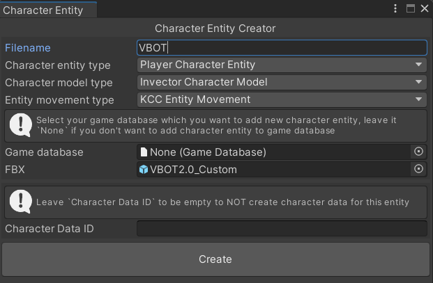
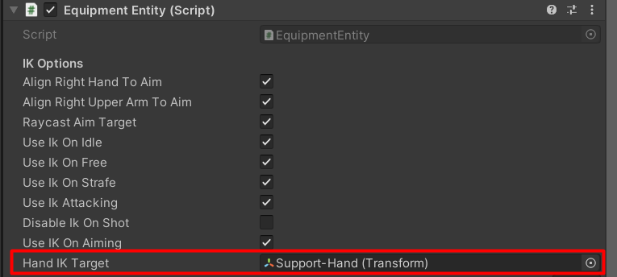

# UnityMultiplayerARPG_InvectorCharacterModel
Character model which uses Invector's animations (Required Shooter Template), it just uses Invector's animation, it has IK system and camera systtem implementation, but not fully implements all Invector's features.

You can create a new character from menu `MMORPG KIT` -> `Character Entity Creator (3D)`, choose `Invector Character Model`.

You can setup weapon IK options in `Invector Character Model` component and in `Equipment Entity` component.

